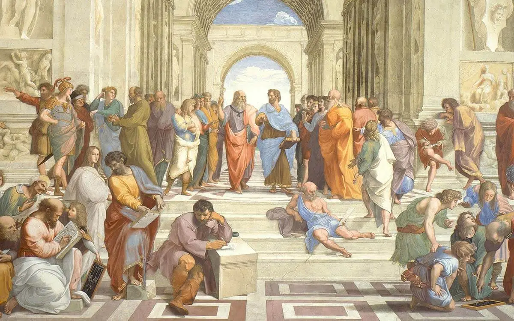

# Applied Data Science @ Columbia
## Spring 2023
## Project 1: A "data story" on the history of philosophy



### [Project Description](doc/)
This is the first and only *individual* (as opposed to *team*) project this semester. 

Term: Spring 2023

+ Projec title: The obscure facts behind the history of Philosophy (A guidebook to find the unknown interactions between schools and authors in the history of Philosophy)
+ This project is conducted by [Haoyu He]

+ Project summary: History has helped us record the ideological civilization and exploration steps left by mankind in the process of continuous development. Through history, people reflect and practice in different fields to promote the formation and development of society. In the field of philosophy, history records different doctrines advocated by various schools and regions such as Plato, Nietzsche, and Socrates, helping future generations to better learn and link to other fields.
However, in today's rapidly developed digital age, we are more eager to use numbers instead of long and complex words, to obtain maximum results in a short time. So, in this analysis, I gonna using power of data to show some unknown relationships between and within authors and schools.
+ Three questions will be answered in this report are:
1. How are authors and schools different from others in terms of the length of sentences they produced?
2. Are authors from distinct schools speak in a similar tone or not? If not, what is the difference?
3. Can we guess the school name backhead by only exposing the sentences themselves?

Following [suggestions](http://nicercode.github.io/blog/2013-04-05-projects/) by [RICH FITZJOHN](http://nicercode.github.io/about/#Team) (@richfitz). This folder is orgarnized as follows.

```
proj/
├── lib/
├── data/
├── doc/
├── figs/
└── output/
```

Please see each subfolder for a README file.
